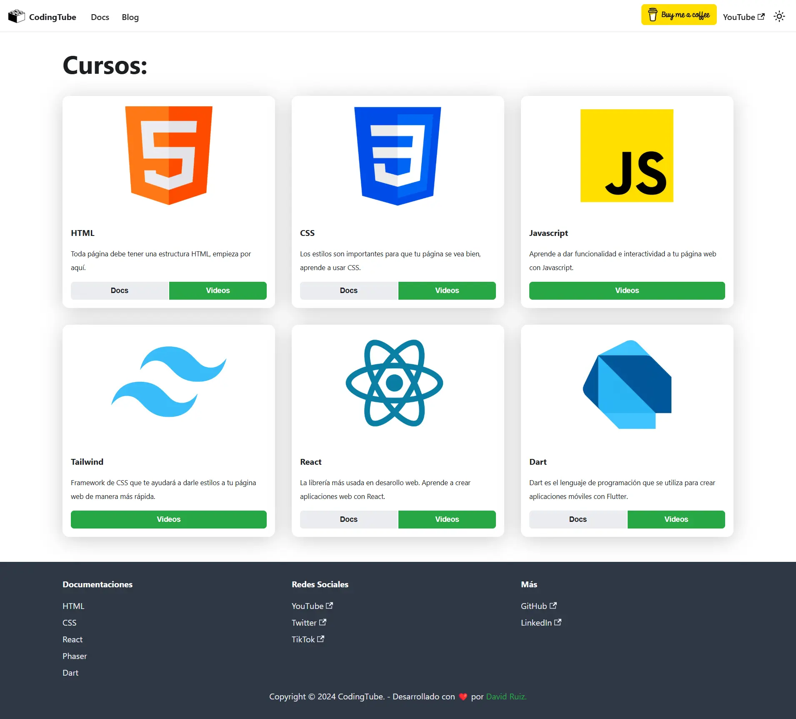

# CodingTube Docs

This repository serves as comprehensive documentation for web development courses offered on the [CodingTube YouTube channel](https://www.youtube.com/CodingTube) . It provides well-structured resources, examples, and guides to complement the learning experience, helping developers of all levels deepen their skills in web development.



## Live site

You can view the live site here: [codingtube.dev](https://www.youtube.com/CodingTube)

## Website

This website is built using [Docusaurus](https://docusaurus.io/), a modern static website generator.

### Installation

```
$ npm install
```

### Local Development

```
$ npm start
```

This command starts a local development server and opens up a browser window. Most changes are reflected live without having to restart the server.

### Build

```
$ npm build
```

This command generates static content into the `build` directory and can be served using any static contents hosting service.