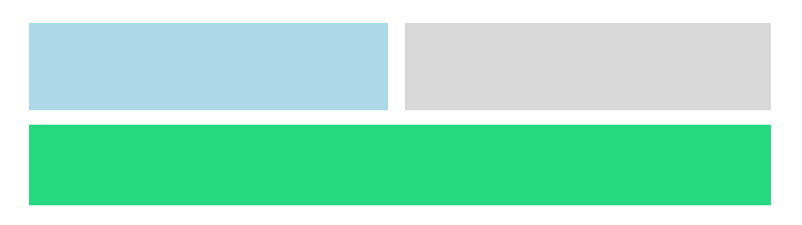

En este artículo te enseñaré a crear un animación en scroll usando únicamente 3 lineas CSS, sin la necesidad de usar librarías o Javascript.

<!--truncate-->

## HTML

Para empezar vamos a crear un archivo HTML `index.html` con la estructura inicial. Este archivo tendrá un div contenedor con la clase `blocks-container` y una docena de bloques con la clase `block`.

```html title="index.html"
<!DOCTYPE html>
<html lang="en">

<head>
  <meta charset="UTF-8">
  <meta name="viewport" content="width=device-width, initial-scale=1.0">
  <link rel="stylesheet" href="./styles.css">
  <title>Animación en scroll</title>
</head>

<body>
  <h1>Animación en Scroll</h1>
  <div class="blocks-container">
    <div class="block"></div>
    <div class="block"></div>
    <div class="block"></div>
    <div class="block"></div>
    <div class="block"></div>
    <div class="block"></div>
    <div class="block"></div>
    <div class="block"></div>
    <div class="block"></div>
    <div class="block"></div>
    <div class="block"></div>
    <div class="block"></div>
  </div>

</body>

</html>
```

## CSS

Estilos generales para los bloques:

```css title="styles.css"
/* Reseteo de espacios */
*{
  margin: 0;
  padding: 0;
}

/* Cambio de fuente */
body {
  font-family: sans-serif;
}

/* Centrado de título */
h1 {
  height: 100vh; 
  font-size: 60px;
  display: grid;
  place-items: center;
}

/* Estilos del contenedor */
.blocks-container {
  max-width: 640px; 
  margin: 0 auto 100px; 
  display: grid; 
  grid-template-columns: repeat(2, 1fr);
  gap: 10px;
}

/* Estilos para cada bloque */
.block {
  background: lightblue;
  margin: 4px;
  height: 300px;
}

/* Cada tres bloques tendrá un estilo diferente */
.block:nth-child(3n) {
  background: rgb(36, 217, 127);
  grid-column: span 2;
}
```

Seguido del código CSS anterior, creamos una animación llamada `show`. Esta animación cambia la opacidad de 0 a 1 y la tamaño de los bloques  de 0.5 a 1.:

```css title="styles.css"

/* Animación con el nombre show*/
@keyframes show {
  from {
    opacity: 0;
    scale: 0.5;
  }

  to {
    opacity: 1;
    scale: 1;
  }
}
```

:::tip[Tip]
Si quieres profundizar en animaciones con CSS te recomiendo este video de [aquí](https://www.youtube.com/watch?v=bqQscQXxIls&list=PLJubkp8BnTJt1u6z_voRiYtwskmP0VVzw&index=11)
:::

## Las tres líneas de código

Las tres líneas de código que hacen la magia son las siguientes:

```css title="styles.css"

.block {
  animation: show linear;
  animation-timeline: view();
  animation-range: entry 0%;
}
```

- `animation: show linear` ejecuta la animación `show` de forma lineal.
- `animation-timeline: view()` se encarga de que la animación se ejecute cuando el bloque se muestra en pantalla.
- `animation-range: entry 0%` establece el punto de entrada de la animación.

## Explicación en video

¿Deseas ver esta explicación a detalle en video? Te lo dejo a continuación:

<iframe width="100%" height="444" src="https://www.youtube.com/embed/_RnAjHBe-Io?si=xMa1vQvjir0F1jRT" title="YouTube video player" frameborder="0" allow="accelerometer; autoplay; clipboard-write; encrypted-media; gyroscope; picture-in-picture; web-share" referrerpolicy="strict-origin-when-cross-origin" allowfullscreen></iframe>