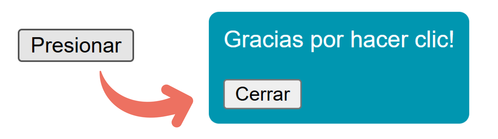

En este artículo te enseñaré como crear un popup únicamente con 3 lineas de HTML. Adicionalmente, te mostraré como agregar algunos estilos sencillos para el pop-up.

<!--truncate-->

## HTML

Dentro de tu HTML deberás agregar estas tres líneas:

```html
<body>
  // (1) Botón que llama al pop-up a través del atributo `popovertarget`
  <button popovertarget="popup">Presionar</button>

  // (2) Pop-up con el id `popup` necesario para poderlo llamar desde el botón
  <div id="popup"popover>
    Gracias por hacer clic!

  // (3) Botón para cerrar el pop-up a través del atributo `popovertargetaction`
    <button popovertarget="popup" popovertargetaction="hide">Cerrar</button>
  </div>
</body>
```

Todo el archivo HTML deberá verse de la siguiente manera:

```html title="index.html"
<!DOCTYPE html>
<html lang="en">

<head>
  <meta charset="UTF-8">
  <meta name="viewport" content="width=device-width, initial-scale=1.0">
  <link rel="stylesheet" href="./styles.css">
  <title>PopUp</title>
</head>

<body>
  // (1) Botón que llama al pop-up a través del atributo `popovertarget`
  <button popovertarget="popup">Presionar</button>

  // (2) Pop-up con el id `popup` necesario para poderlo llamar desde el botón
  <div id="popup"popover>
    Gracias por hacer clic!

    // (3) Botón para cerrar el pop-up a través del atributo `popovertargetaction`
    <button popovertarget="popup" popovertargetaction="hide">Cerrar</button>
  </div>
</body>

</html>
```

## CSS

Lo siguiente es opcional, solamente para dar un poco de estilo y animaciones:

```css title="styles.css"
#popup{
  /* Estilos del pop up */
  background-color: rgb(176, 76, 76);
  border-radius: 8px;
  color: #fff;
  font-family: sans-serif;
  padding: 10px;

  /* Establecemos el tiempo de animación y el suavizado como ingresa el pop up */
  animation: slide 0.25s ease-out

}

/* Animación de nombre slide */
@keyframes slide {
  from{
    transform: translateY(-200px);
  }
}
```

:::tip[Tip]
Si quieres profundizar en animaciones con CSS te recomiendo este video de [aquí](https://www.youtube.com/watch?v=bqQscQXxIls&list=PLJubkp8BnTJt1u6z_voRiYtwskmP0VVzw&index=11)
:::

## Explicación en video:

A continuación podrás ver toda esta explicación en video.

<iframe width="100%" height="444" src="https://www.youtube.com/embed/tzT1ogxT4ZQ?si=rtPwEWP0v-Bb4If9" title="YouTube video player" frameborder="0" allow="accelerometer; autoplay; clipboard-write; encrypted-media; gyroscope; picture-in-picture; web-share" referrerpolicy="strict-origin-when-cross-origin" allowfullscreen></iframe>