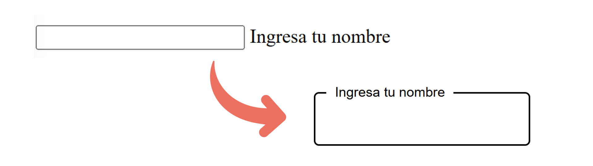

En este artículo aprenderás a crear una animación del `label` de un `input` cuando se ha hecho clic sobre él.

<!--truncate-->

## HTML

Empezamos con la estructura HTML que es muy sencilla, un `div` con la clase `input-field` dentro del `body`. Este `div` tendrá un `input` y un `label` dentro del mismo:

```html	
<!DOCTYPE html>
<html lang="en">
<head>
  <meta charset="UTF-8">
  <meta name="viewport" content="width=device-width, initial-scale=1.0">
  <link rel="stylesheet" href="./styles.css">
  <title>Input con label flotante</title>
</head>
<body>
  <div class="input-field">
    <input id="name" type="text">
    <label for="name">Ingresa tu nombre</label>
  </div>
</body>
</html>
```

## CSS:

Luego, dentro del CSS, agregamos un color de fondo y definimos la tipografía:

```css
body{
  font-family: sans-serif;
}
```

Al `div` contenedor le agregamos la propiedad `position` con el valor `relative` para que todos los elementos hijos puedan posicionarse con respecto a él:

```css
.input-field{
  position: relative;
}
```

### Estilos del `input`:

```css
.input-field input{
  height: 60px; 
  border-radius: 6px;
  font-size: 18px;
  padding: 0 15px;
  border: 2px solid black;
  background: transparent;
}
```

### Estilos del `label`:

```css
.input-field label{
  position: absolute;
  left: 15px;
  /* Las siguientes dos propiedades centrar el label dentro del input: */
  top: 50%;
  transform: translateY(-50%);
  font-size: 19px;
  transition: 250ms; 
}

/* Esto va a ejecutarse cuando se haga clic en el input: */
input:focus ~ label{
  top: 0;
  font-size: 16px;
  padding: 0 10px;
  background-color: white;
}
```

:::note[Nota]
El signo `~` en CSS es el combinador de hermanos generales (general sibling combinator). Se utiliza para seleccionar un elemento que es hermano del primer elemento y aparece después de él en el mismo nivel del árbol DOM.
:::

## Resultado:

El códiGo final, sin los comentarios quedaría así:

```css
body{
  font-family: sans-serif;
}

.input-field{
  position: relative;
}

.input-field input{
  height: 60px;
  border-radius: 6px;
  font-size: 18px;
  padding: 0 15px;
  border: 2px solid black;
  background: transparent;
}

.input-field label{
  position: absolute;
  top: 50%;
  left: 15px;
  transform: translateY(-50%);
  font-size: 19px;
  transition: 250ms; 
  background-color: white;
}

input:focus ~ label{
  top: 0;
  font-size: 16px;
  padding: 0 10px;
}
```	