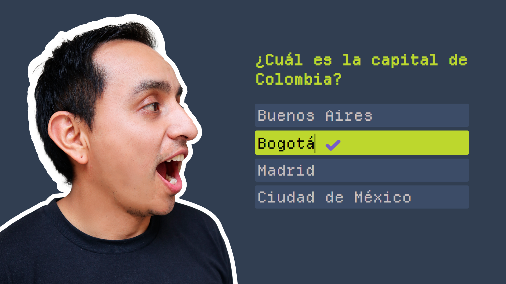

En este blog encontrarás el código `Javascript` de ejemplo con las preguntas y respuestas utilizado en el video de YouTube, donde se explica el código paso a paso.

<!--truncate-->

## JS:

```js	
export const preguntasYRespuestas = {
  "capitales": [
    {
      "pregunta": "¿Cuál es la capital de Colombia?",
      "respuestas": [
        "Buenos Aires",
        "Bogotá",
        "Madrid",
        "Ciudad de México"
      ],
      "respuestaCorrecta": "Bogotá"
    },
    {
      "pregunta": "¿Cuál es la capital de México?",
      "respuestas": [
        "Santiago",
        "Quito",
        "Ciudad de México",
        "Lima"
      ],
      "respuestaCorrecta": "Ciudad de México"
    },
    {
      "pregunta": "¿Cuál es la capital de Argentina?",
      "respuestas": [
        "Buenos Aires",
        "Bogotá",
        "Madrid",
        "Ciudad de México"
      ],
      "respuestaCorrecta": "Buenos Aires"
    }
  ],
  "programación": [
    {
      "pregunta": "¿Cuál no es un lenguaje de programación?",
      "respuestas": [
        "HTML",
        "Javascript",
        "Dart",
        "Java"
      ],
      "respuestaCorrecta": "HTML"
    },
    {
      "pregunta": "¿Qué significa CSS?",
      "respuestas": [
        "Casa Salsa Salada",
        "Casi Sale el Sol",
        "Cascade Style Sheets",
        "Common Style Sheets"
      ],
      "respuestaCorrecta": "Cascade Style Sheets"
    },
    {
      "pregunta": "¿Cual es el diminutivo de Javascript?",
      "respuestas": [
        "JS",
        "Java",
        "JavaS",
        "JScript"
      ],
      "respuestaCorrecta": "JS"
    }
  ]
}
```