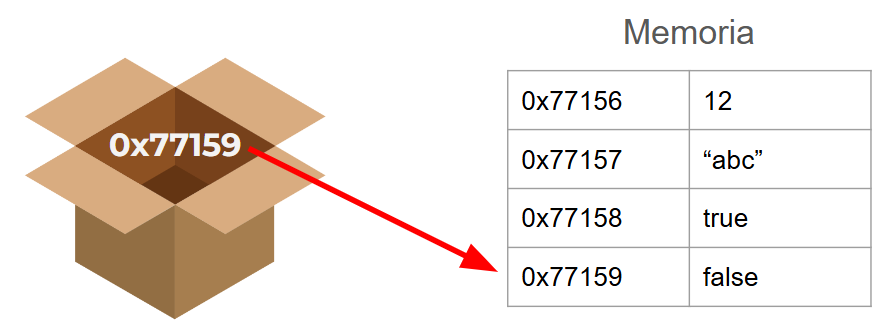

# Variables en Dart 🗃️ 

Imagina una variable como una caja donde puedes guardar diferentes tipos de información, ya sean números, texto o valores booleanos (verdadero o falso). 

Para ser técnicamente más precisos, en Dart y en muchos lenguajes de programación, realmente no se guarda el valor como tal, sino una referencia en memoria de lo que se está guardando. En la siguiente imagen se ilustra este concepto. En la variable, representada por una caja, se guarda la referencia en memoria (0x77159) del valor booleano `false`, no se guarda el valor como tal:




## Cómo crear una variable en Dart

Existen muchas formas de crear variables en Dart. A continuación te mostraré las más comunes, pero antes recuerda que todo código en Dart tiene que estar envuelto dentro de una función `main`.

```dart
void main() {
  // tu código va aquí
}
```

### 1. Usando la palabra reservada `var`

Para crear una variable con la palabra reservada `var`, simplemente agrégala antes del nombre de la variable, como por ejemplo:

```dart
void main() {
  var edad = 10;
}
```

Al utilizar `var` Dart infiere el tipo de dato de la variable. En el ejemplo anterior, Dart detecta que la variable `edad` es de tipo entero (`int`) por que tiene asignado un número `10`. 

Existen varios tipos de datos:

- `int` (entero)
- `double` (decimal)
- `String` (cadena de texto)
- `bool` (verdadero o falso)

:::note[Nota]
El tipo de dato `String` es el único que se escribe con la primera letra en mayúsulas.
:::

De esta forma dart puede inferir el tipo de dato de la variable según el valor que le demos a la variable:

```dart
void main() {
  var edad = 10; // int
  var temperatura = 18.5; // double
  var nombre = 'David'; // String
  var estado = true; // bool
}
```

### 2. Especificando el tipo de dato de una variable

Una práctica más recomendada al momento de declarar variables, es especificar el tipo de dato de la variable al momento de crearla sin la palabra reservada `var`. Es decir:


```dart
void main() {
  int edad = 10;
  double temperatura = 18.5;
  String nombre = 'David';
  bool estado = true;
}
```

:::important[Importante]
Es preferible no dejar que Dart infiera el tipo de dato de la variable. En códigos más complejos es posible que Dart no infiera correctamente el tipo de dato. Por eso se recomienda, como buena práctica, siempre especificar el tipo de dato manualmente aunque se trate de un código sencillo.
:::

### 3. Creando variables sin valor inicial

Es posible crear variables sin asignarle un valor inicial:

```dart
void main() {
  var userName; // Dart infiere este dato como dynamic
  String userName; // Dart infiere este dato como String
}
```

Tanto con la palabra reservada `var` como sin ella, se puede crear una variable sin valor inicial. La diferencia aquí, es que con la palabra reservada `var` el tipo de dato inferido será `dynamic`, mientras que especificando su tipo manualmente, se podrá especificar el tipo de dato exacto. De ahí la recomendación de en la medida de lo posible, no dejar que Dart infiera el tipo de dato.


### 4. Usando las palabras reservadas `final` y `const`

Ambas palabras reservadas me permiten especificar variables que no pueden cambiar de valor, es decir constantes. Pero su diferencia radica en que `final` podrá inicializarse con un valor diferente cada vez que se ejecuta el programa (tiempo de ejecución) mientras que con `const` no. Veamos el siguiente ejemplo:

```dart
void main() {
  const marcaAuto = 'BMW'; // Siempre va a ser 'BMW'
  final fechaActual = DateTime.now(); // La fecha actual varía en cada ejecución
}
```

Cuando especificamos a una variable con la palabra reservada `final` le estamos diciendo a Dart que la variable puede cambiar en tiempo de ejecución. En el ejemplo anterior, la fecha actual va a cambiar cada vez que se ejecute el programa. Pero sigue siendo una constante, una vez asignado el valor, ya no se podrá cambiar, hasta que se reinicie el programa.

En cambio con la palabra reservada `const` el valor de la constante no puede cambiar nunca. No importa las veces que se vuelva a ejecutar el programa.

### 5. Usando la palabra reservada `late`

Finalmente, la palabra reservada `late` sirve para especificar valores que no se conoce aún su valor, pero que se deberá asignar a lo largo de la ejecución del programa. Como en el ejemplo anterior donde se creó una variable `String userName;` sin asignarle un valor, también se lo pudo asignar de la siguiente forma:


```dart
void main() {
  late String userName; 
}
```

:::note[Nota]
Si bien es cierto solamente especificando el tipo de variable ya se se puede crear la misma, es recomendable detallar que su valor será asignado más adelante con la palabra reservada `late`. 

Entre más información se especifique en la creación de una variable, más posibles errores podremos evitar a futuro porque Dart tendrá más información de la variable.
:::

## Explicación en video

Todo lo que está en este artículo con algunos ejemplos extras lo puedes encontrar explicado en video aquí:

<iframe width="100%" height="444" src="https://www.youtube.com/embed/ZbsHC5jGOcQ?si=ZzzVUbw9_CgyC8B1" title="YouTube video player" frameborder="0" allow="accelerometer; autoplay; clipboard-write; encrypted-media; gyroscope; picture-in-picture; web-share" referrerpolicy="strict-origin-when-cross-origin" allowfullscreen></iframe>